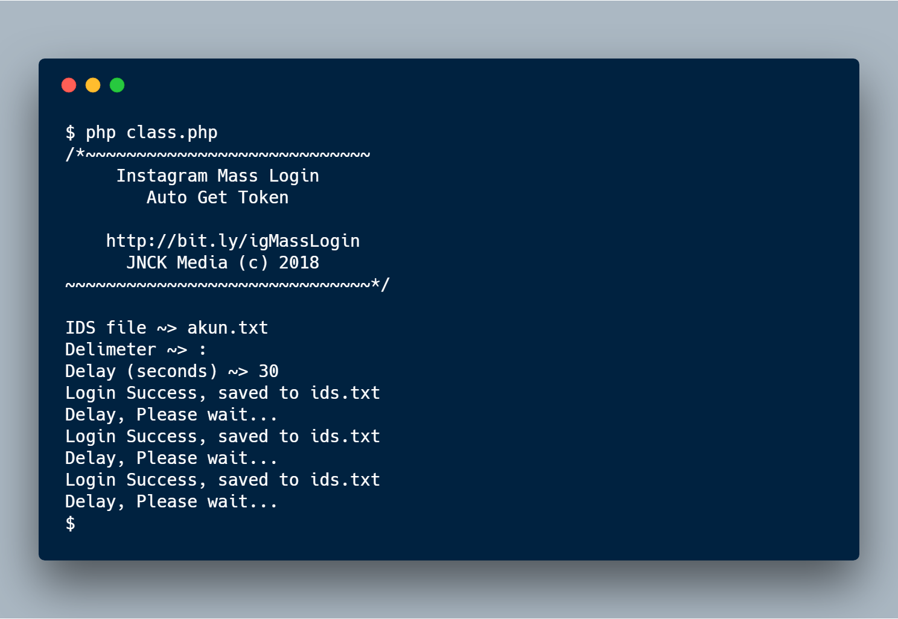

# igMassLogin

Install & Run
--
```
git clone https://github.com/dandyraka/igMassLogin
cd igMassLogin
php run.php
```

Example
--


Explanation
--
`IDS File` Your ids file, example akun.txt

`Delimeter` Example ~> : or |

`Delay` Delay in seconds, Ex : 10, 20, 30

If Login Success, result will be saved at `ids.txt`

The you can input the result to the Instagram Mass Follow

`Instagram Mass Follow` https://jnckmedia.com/igMassFollow/
